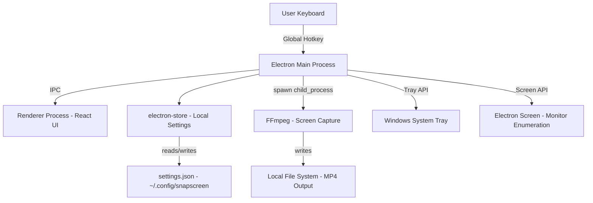

# PRD — SnapScreen

## 1. Overview

### Product Summary

**SnapScreen** — Record the screen you mean to record. Nothing else.

SnapScreen is a lightweight Windows system tray utility that lets users pre-select which monitor to record on a dual or extended display setup, then start and stop recording with a global hotkey. It sits silently in the system tray, requires no app window to operate in normal use, and saves recordings as MP4 files to a local folder. No accounts, no cloud, no complexity.

### Objective

This PRD covers the SnapScreen MVP as defined in `docs/product-vision.md` § Product Strategy — MVP Definition. The MVP delivers the complete core recording loop: install → select monitor → hotkey records → hotkey stops → MP4 saved. The goal is a fully functional, reliable desktop utility on Windows 10/11 that can be validated with friends, family, and colleagues within 90 days.

### Market Differentiation

SnapScreen wins by doing exactly one thing and doing it with zero friction. Xbox Game Bar records whichever screen has focus — not the one you pre-selected. OBS requires creating scenes and sources before any recording is possible. SnapScreen's technical implementation must deliver on the core promise: the selected monitor is persisted, the hotkey works globally, and the recording starts within 1 second of the keypress. Any latency, any wrong-screen capture, or any crash breaks the product's core value.

### Magic Moment

The magic moment is: user presses Win+Shift+R from any app on any screen, and exactly the monitor they configured starts recording within 1 second — no mouse clicks, no app window, no wrong-screen surprise. The technical requirements for this moment are: globally registered hotkey, monitor index persisted across restarts, FFmpeg capture pipeline targeting the correct display geometry, and tray icon state update to confirm recording is active.

### Success Criteria

- Time from hotkey press to first recorded frame: under 1 second (measured on a mid-range Windows 11 machine)
- Time from install to first successful MP4 recording: under 2 minutes
- Recording saves a valid, playable MP4 file 100% of the time (no silent failures)
- All P0 functional requirements implemented and manually verified
- App runs on Windows 10 (21H2+) and Windows 11 without modification
- No console errors or unhandled exceptions during normal operation

---

## 2. Technical Architecture

### Architecture Overview



The architecture is entirely local. The Electron main process is the hub — it owns the tray icon, the global hotkey, the settings store, the monitor enumeration, and the FFmpeg child process lifecycle. The renderer process is used only for the settings panel UI. There is no IPC required for recording start/stop — those are triggered directly from the main process via the global hotkey handler.

### Chosen Stack

| Layer | Choice | Rationale |
|---|---|---|
| Frontend (UI) | Electron + TypeScript + React | Mature ecosystem, best Claude Code/Cursor support, proven for desktop tray utilities, straightforward Mac port later |
| Application Shell | Electron (main process) | Handles OS integration: tray, hotkeys, screen APIs, child processes, file system — all in Node.js |
| Local Storage | electron-store | Lightweight JSON persistence for user preferences, TypeScript-friendly, zero setup |
| Screen Capture Engine | FFmpeg (child process) | Mature, reliable, handles H.264/MP4 output, well-documented Windows screen capture via gdigrab/ddagrab |
| Auth | None | Local utility — no authentication required |
| Payments | None (MVP) | Free tier validation first; Polar to be integrated in Pro tier |

### Stack Integration Guide

**Setup order:**
1. Initialize Electron + TypeScript project with Vite as bundler (use `electron-vite` template)
2. Add React to the renderer process
3. Configure Tailwind CSS in the renderer
4. Add electron-store for settings persistence
5. Add global-hotkey library (`electron-globalShortcut` built-in — no extra package needed)
6. Bundle FFmpeg binary with the application (use `ffmpeg-static` package)

**Critical integration patterns:**

`electron-globalShortcut` is only available in the main process. Register hotkeys in `main.ts` after the app `ready` event. Never try to register shortcuts from the renderer.

For IPC between renderer (settings panel) and main process, use `contextBridge` + `ipcRenderer`/`ipcMain`. Never expose `ipcRenderer` directly to the renderer — wrap it with `contextBridge.exposeInMainWorld`.

FFmpeg's Windows screen capture backend: use `gdigrab` for broad compatibility (Windows 7+); use `ddagrab` (DirectShow Desktop Duplication API) for better performance on Windows 10+. Default to `ddagrab` with fallback to `gdigrab` if ddagrab fails to initialize.

`electron-store` must be instantiated in the main process and accessed from the renderer via IPC — it cannot be used directly in the renderer process.

**Required environment variables:**
None — fully local app. No `.env` file needed for MVP.

**Common gotchas:**
- `electron.screen.getAllDisplays()` returns displays with their bounds (x, y, width, height). These bounds are what you pass to FFmpeg as the capture region. On Windows, the primary display always starts at (0, 0); secondary displays have offset coordinates that may be negative.
- `ffmpeg-static` bundles a pre-built FFmpeg binary. Access it via `require('ffmpeg-static')` in the main process — this returns the path to the binary.
- Global shortcuts must be unregistered before the app quits (`app.on('will-quit', () => globalShortcut.unregisterAll())`).
- The Electron app should call `app.setLoginItemSettings({ openAtLogin: true })` for startup behavior — use electron-store to persist the user's preference.

### Repository Structure

```
snapscreen/
├── electron/
│   ├── main.ts                 # Main process entry: app lifecycle, tray, hotkeys
│   ├── tray.ts                 # Tray icon management, context menu construction
│   ├── recorder.ts             # FFmpeg child process management, recording lifecycle
│   ├── monitors.ts             # Monitor enumeration via electron.screen API
│   ├── settings.ts             # electron-store schema and typed settings access
│   ├── ipc.ts                  # IPC handlers (main-side) for renderer communication
│   └── preload.ts              # contextBridge — exposes safe API to renderer
├── src/
│   ├── App.tsx                 # Root React component for settings panel
│   ├── components/
│   │   ├── MonitorSelector.tsx # Monitor list with resolution display
│   │   ├── HotkeyInput.tsx     # Hotkey capture and display input
│   │   ├── FolderPicker.tsx    # Output folder selection
│   │   ├── AudioSourceSelect.tsx # Audio input/output selection
│   │   └── ToggleRow.tsx       # Reusable label + toggle component
│   ├── hooks/
│   │   └── useSettings.ts      # Settings read/write via IPC
│   └── styles/
│       └── globals.css         # CSS variables (design tokens), Tailwind base
├── assets/
│   ├── icon.ico                # App icon (16/32/48px variants)
│   ├── tray-idle.ico           # Tray icon — idle state
│   ├── tray-recording.ico      # Tray icon — recording (with red badge)
│   └── tray-error.ico          # Tray icon — error state
├── electron.vite.config.ts     # electron-vite build configuration
├── package.json
├── tsconfig.json
├── tailwind.config.ts
└── docs/                       # Product vision, PRD, roadmap (this file)
```

### Infrastructure & Deployment

**Distribution:** GitHub Releases as the primary distribution channel. Package as a Windows NSIS installer (`.exe`) and/or portable executable using `electron-builder`.

**Build configuration:** Use `electron-builder` with NSIS target for Windows. Configure `appId`, `productName`, `copyright`. Include the FFmpeg binary in `extraResources` so it's available at runtime.

**Auto-updater:** Integrate `electron-updater` (part of electron-builder ecosystem) to check for updates from GitHub Releases. Updates download in the background and are applied on next launch. Don't prompt mid-recording.

**Code signing:** Required before any public release to avoid Windows SmartScreen warnings. Use an OV (Organization Validation) code signing certificate. Cost: ~$70–200/year. Set up in `electron-builder` `win.signingHashAlgorithms` config.

**No CI/CD required for MVP.** Build locally and upload to GitHub Releases manually.

**Environment variables needed at build time only:**
- `CSC_LINK` — path to code signing certificate (for signed builds)
- `CSC_KEY_PASSWORD` — certificate password

### Security Considerations

**contextIsolation: true** — required in all BrowserWindow instances. Never disable this.

**nodeIntegration: false** — required in renderer. All Node.js access goes through contextBridge.

**sandbox: true** — enable in renderer BrowserWindow config for additional isolation.

**contextBridge API surface:** Expose only the specific functions the renderer needs. The preload script should not expose broad APIs — only named functions for: reading settings, writing settings, getting monitor list, opening folder picker, getting hotkey binding.

**No network requests** in the MVP. If auto-update is added, use `electron-updater` which handles this securely. Never make raw `fetch` or `http` calls from the main process without validating the target URL.

**File system access:** Only write to the user-configured output folder. Never write outside of this path. Validate that the output folder path is within the user's home directory or a user-selected path (not a system directory).

**FFmpeg child process:** Spawn with `shell: false` and explicit argument array — never build a shell command string with user input. This prevents injection attacks even though user input here is limited to display bounds (integers) and file paths.

### Cost Estimate

For the first 6 months at low scale (< 1,000 users):

| Service | Cost | Notes |
|---|---|---|
| GitHub (source + releases) | $0 | Free for public repos |
| electron-builder distribution | $0 | Self-hosted releases |
| Code signing certificate | ~$70–200/year | Required for public launch |
| Domain (snapscreen.app or similar) | ~$12/year | Optional for MVP |
| **Total** | **~$82–212/year** | Minimal operational cost |

No server costs. No database costs. No cloud infrastructure. The app is entirely local.

---

## 3. Data Model

### Entity Definitions

SnapScreen uses `electron-store` for local settings persistence. There is no server-side database. The store is typed with a TypeScript schema:

```typescript
// electron/settings.ts — electron-store schema

interface SnapScreenSettings {
  // Monitor selection
  selectedDisplayId: number | null;    // Electron display ID from screen.getAllDisplays()
  selectedDisplayLabel: string;        // Human-readable label, e.g. "Display 2 (2560×1440)"

  // Hotkey
  hotkeyAccelerator: string;          // Electron accelerator format, e.g. "CommandOrControl+Shift+R"

  // Output
  outputFolder: string;               // Absolute path to output directory
  filenameDateFormat: string;         // Default: "YYYY-MM-DD_HHmmss"

  // Audio
  audioSource: 'system' | 'mic' | 'both' | 'none'; // Default: 'system'

  // App behavior
  launchAtStartup: boolean;           // Default: true
  showNotificationOnSave: boolean;    // Default: true

  // Internal state (not user-facing)
  isFirstRun: boolean;                // Default: true — cleared after first successful recording
  appVersion: string;                 // Current version, for migration detection
}

// Defaults (applied by electron-store if values are missing)
const defaults: SnapScreenSettings = {
  selectedDisplayId: null,
  selectedDisplayLabel: 'Not selected',
  hotkeyAccelerator: 'CommandOrControl+Shift+R',
  outputFolder: path.join(app.getPath('videos'), 'SnapScreen'),
  filenameDateFormat: 'YYYY-MM-DD_HHmmss',
  audioSource: 'system',
  launchAtStartup: true,
  showNotificationOnSave: true,
  isFirstRun: true,
  appVersion: app.getVersion(),
};
```

### Relationships

No relational data model. All settings are flat key-value pairs in a single JSON file at:
`%APPDATA%\snapscreen\config.json` (Windows)

### Indexes

Not applicable — single flat JSON object, no querying needed.

---

## 4. API Specification

### API Design Philosophy

SnapScreen uses Electron IPC (Inter-Process Communication) between the main process and renderer process. This is not a REST API — it's a typed message-passing system. All IPC calls are initiated from the renderer process and handled in the main process. Use `ipcRenderer.invoke` (promise-based, two-way) for all calls — never use `ipcRenderer.send` (fire-and-forget) for operations that return data.

### IPC Endpoints

All handlers are defined in `electron/ipc.ts` and registered via `ipcMain.handle`.

```typescript
// READ SETTINGS
ipcMain.handle('settings:get', async () => {
  returns: SnapScreenSettings
})

// WRITE SETTING
ipcMain.handle('settings:set', async (event, key: keyof SnapScreenSettings, value: any) => {
  // Validates key exists in schema, validates value type
  returns: { success: boolean; error?: string }
})

// GET MONITORS
ipcMain.handle('monitors:list', async () => {
  returns: Array<{
    id: number;            // Electron display ID
    label: string;         // "Display 1 (1920×1080) — Primary" or "Display 2 (2560×1440)"
    isPrimary: boolean;
    bounds: { x: number; y: number; width: number; height: number };
    scaleFactor: number;
  }>
})

// OPEN FOLDER PICKER DIALOG
ipcMain.handle('dialog:openFolder', async () => {
  // Opens native Windows folder picker dialog
  returns: string | null  // Selected path, or null if cancelled
})

// OPEN FOLDER IN EXPLORER
ipcMain.handle('shell:openFolder', async (event, folderPath: string) => {
  // Opens the given folder path in Windows Explorer
  returns: void
})

// GET RECORDING STATE
ipcMain.handle('recorder:getState', async () => {
  returns: 'idle' | 'recording' | 'error'
})

// VALIDATE HOTKEY (check for conflicts)
ipcMain.handle('hotkey:validate', async (event, accelerator: string) => {
  returns: { valid: boolean; conflict?: string }
})

// GET APP VERSION
ipcMain.handle('app:getVersion', async () => {
  returns: string
})
```

**Tray context menu** is constructed in `electron/tray.ts` in the main process — no IPC needed for tray interactions.

**Recording start/stop** is triggered directly by the global hotkey in the main process — no IPC needed. The tray icon updates within the same process.

---

## 5. User Stories

### Epic: Monitor Selection & Configuration

**US-001: Select recording monitor**
As Alex, I want to choose which monitor SnapScreen records from a list in the tray menu so that I never accidentally record the wrong screen.

Acceptance Criteria:
- [ ] Given I right-click the tray icon, when I hover "Select Monitor," I see all connected monitors listed by name (Display 1, Display 2) with their resolutions
- [ ] Given I click a monitor in the list, when I look at the tray menu next time, a checkmark appears next to the selected monitor
- [ ] Given I select a monitor, when I restart the app, the same monitor is still selected
- [ ] Edge case: If only one monitor is connected, Display 1 is auto-selected and the monitor list shows one item

**US-002: Identify which monitor is which**
As Alex, I want to see monitor resolutions and "Primary" label in the monitor list so that I can tell my two monitors apart without guessing.

Acceptance Criteria:
- [ ] Given I open the monitor list, when I see the entries, each shows resolution (e.g. 1920×1080) and "(Primary)" label where applicable
- [ ] Given I have two monitors with the same resolution, when I see the list, the Primary label distinguishes them

### Epic: Recording

**US-003: Start recording with hotkey**
As Alex, I want to press a keyboard shortcut from any application and have SnapScreen start recording my chosen monitor so that I don't have to click anything.

Acceptance Criteria:
- [ ] Given SnapScreen is running and a monitor is selected, when I press the default hotkey (Win+Shift+R), recording starts within 1 second
- [ ] Given recording has started, when I look at the tray icon, it shows a red recording indicator
- [ ] Given another app is in focus, when I press the hotkey, SnapScreen still starts recording (global hotkey)
- [ ] Edge case: If no monitor is selected, pressing the hotkey shows a tray notification: "Please select a monitor first."

**US-004: Stop recording with hotkey**
As Alex, I want to press the same hotkey to stop recording so that I don't have to switch apps or click anything to finish a capture.

Acceptance Criteria:
- [ ] Given recording is active, when I press the hotkey again, recording stops within 500ms
- [ ] Given recording stops, when I check my output folder, an MP4 file is present with the correct timestamp name
- [ ] Given recording stops, when I look at the tray icon, it returns to the idle indicator
- [ ] Given notifications are enabled, when recording stops, a tray notification appears with the filename and "click to open folder" action

**US-005: View recording state in tray**
As Alex, I want to know at a glance whether SnapScreen is currently recording so that I don't accidentally leave a recording running.

Acceptance Criteria:
- [ ] Given the app is idle, when I look at the system tray, the SnapScreen icon shows no recording indicator
- [ ] Given the app is recording, when I look at the system tray, the SnapScreen icon shows a red dot/badge
- [ ] Given I hover over the tray icon, the tooltip shows "SnapScreen — Recording in progress" or "SnapScreen — Ready"

### Epic: Settings

**US-006: Change output folder**
As Alex, I want to choose where my recordings are saved so that they go to a folder I've already organized.

Acceptance Criteria:
- [ ] Given I open Settings, when I click the Output Folder field, a native Windows folder picker opens
- [ ] Given I select a folder, when I save settings, the next recording saves to that folder
- [ ] Given I close and reopen the settings panel, the folder I chose is still shown

**US-007: Customize hotkey**
As Alex, I want to change the recording hotkey to avoid conflicts with my existing tools so that SnapScreen doesn't break my other keyboard shortcuts.

Acceptance Criteria:
- [ ] Given I open Settings, when I click the Hotkey field and press a key combination, the field shows the new combination
- [ ] Given I press a hotkey that's already used by another app, when I save, a warning message appears (but the change is still saved)
- [ ] Given I change the hotkey, when I close settings, the new hotkey immediately works for recording

**US-008: Configure audio source**
As Alex, I want to choose whether my recording captures system audio, microphone, both, or neither so that my recordings include the right audio for the context.

Acceptance Criteria:
- [ ] Given I open Settings, the Audio Source dropdown shows four options: System Audio, Microphone, Both, None
- [ ] Given I select an audio source, when I record, the MP4 file includes audio from the configured source
- [ ] Given I select None, when I record, the MP4 file has no audio track

**US-009: Launch at startup**
As Alex, I want SnapScreen to start automatically when I log in to Windows so that it's always available without me having to remember to open it.

Acceptance Criteria:
- [ ] Given I enable "Launch at Startup" in settings, when I restart Windows, SnapScreen appears in the system tray automatically
- [ ] Given I disable "Launch at Startup," when I restart Windows, SnapScreen does not start automatically
- [ ] The setting defaults to enabled on first install

---

## 6. Functional Requirements

**FR-001: Tray Application Shell**
Priority: P0
Description: SnapScreen launches as a tray-only application. No main window appears on launch. The app is accessible exclusively via the system tray icon. The app icon appears in the Windows system tray notification area. Closing the tray menu does not quit the app.
Acceptance Criteria:
- App launches to tray without showing any window
- Right-clicking tray icon opens context menu
- Context menu has: "Select Monitor" submenu, "Settings" option, "Quit SnapScreen" option
- App continues running after context menu is dismissed
Related Stories: US-003, US-004, US-005

**FR-002: Monitor Enumeration**
Priority: P0
Description: On tray menu open and on Settings panel open, enumerate all connected displays using `electron.screen.getAllDisplays()`. Present each display with a human-readable label including index number (starting from 1), resolution, and "(Primary)" marker for the primary display.
Acceptance Criteria:
- All connected monitors are listed, including the primary
- Label format: "Display N (WxH)" or "Display N (WxH) — Primary"
- List updates dynamically if monitors are connected/disconnected while the app is running
Related Stories: US-001, US-002

**FR-003: Monitor Selection Persistence**
Priority: P0
Description: When the user selects a monitor, store the Electron display ID and label in electron-store. On subsequent app launches, restore the previously selected monitor. If the stored display ID is no longer present (monitor disconnected), fall back to the primary display and show a tray notification: "Display [N] not found — using primary display."
Acceptance Criteria:
- Selection persists across app restarts
- Graceful fallback when stored monitor is unavailable
- Selected monitor is visually marked (checkmark) in tray menu
Related Stories: US-001

**FR-004: Global Hotkey Registration**
Priority: P0
Description: Register a global keyboard shortcut using Electron's built-in `globalShortcut` API. Default accelerator: `"CommandOrControl+Shift+R"`. The hotkey must work while any other application has focus. On press, toggle recording state (start if idle, stop if recording). Unregister the hotkey on app quit.
Acceptance Criteria:
- Hotkey works when SnapScreen is not the focused window
- Hotkey works when SnapScreen's settings window is open
- Hotkey is unregistered on app quit (verified by no conflict on next launch)
- If hotkey registration fails (conflict), log a warning and show tray notification
Related Stories: US-003, US-004

**FR-005: Screen Capture via FFmpeg**
Priority: P0
Description: On recording start, spawn an FFmpeg child process that captures the selected monitor's screen. Use the display's `bounds` (x, y, width, height) from `electron.screen` to target the specific monitor. Default output: MP4 with H.264 video and AAC audio. FFmpeg binary sourced from `ffmpeg-static` package bundled with the app.

FFmpeg command structure for Windows:
```
ffmpeg -f {backend} -i desktop -vf "crop={width}:{height}:{x}:{y}" -c:v libx264 -preset ultrafast -c:a aac {outputPath}
```
Where `{backend}` is `ddagrab` (prefer) or `gdigrab` (fallback), and crop coordinates target the selected display.

Acceptance Criteria:
- Recording starts within 1 second of hotkey press
- Only the selected monitor is captured (verified by recording a known element on one screen and confirming it doesn't appear in the recording)
- FFmpeg process terminates cleanly on recording stop
- MP4 file is valid and playable in Windows Media Player
Related Stories: US-003, US-004

**FR-006: Tray State Indicator**
Priority: P0
Description: The tray icon changes to reflect recording state. Three states: idle (normal icon), recording (icon with red badge), error (icon with yellow warning badge). The tray tooltip updates to match state.
Acceptance Criteria:
- Icon changes to recording variant immediately when recording starts
- Icon returns to idle variant immediately when recording stops
- Tooltip shows "SnapScreen — Ready" when idle
- Tooltip shows "SnapScreen — Recording in progress" when recording
- Tooltip shows "SnapScreen — Error: [brief description]" on error
Related Stories: US-005

**FR-007: MP4 Output to Local Folder**
Priority: P0
Description: Save completed recordings as MP4 files to the user-configured output folder. Default folder: `%USERPROFILE%\Videos\SnapScreen` (created on first use if it doesn't exist). Filename format: `SnapScreen_YYYY-MM-DD_HHmmss.mp4` using the local time at recording start.
Acceptance Criteria:
- Output folder is created automatically if it doesn't exist
- Filename uses recording start time, not stop time
- File is saved atomically (write to temp file, rename on completion) to prevent partial files
- If the output folder is inaccessible, show an error notification and do not silently fail
Related Stories: US-004, US-006

**FR-008: Settings Panel**
Priority: P0
Description: A Settings window opened from the tray menu context item "Settings." The window is a fixed-size Electron BrowserWindow (480×480px, no resize). It presents all configurable settings. Changes are saved immediately on change (no explicit save button needed for toggles and selectors; hotkey field requires pressing Enter or clicking away to confirm).
Acceptance Criteria:
- Settings window opens on "Settings" menu item click
- Only one settings window can be open at a time (clicking Settings while it's open brings it to front)
- Changes to settings take effect immediately without restarting the app
- Settings window can be closed with the window X button or Escape key
Related Stories: US-006, US-007, US-008, US-009

**FR-009: Audio Source Selection**
Priority: P1
Description: Allow users to configure the audio capture source: system audio (Windows WASAPI loopback), microphone (default input device), both, or none. Store preference in electron-store. Apply to the next recording.
Acceptance Criteria:
- Four options available in settings: System Audio, Microphone, Both, None
- Selected option persists across restarts
- Recordings contain the correct audio track (or no audio track if None is selected)
Related Stories: US-008

**FR-010: Launch at Windows Startup**
Priority: P1
Description: Register the app to launch at Windows login using `app.setLoginItemSettings()`. Provide a toggle in Settings. Default: enabled.
Acceptance Criteria:
- Toggle in Settings controls startup behavior
- Setting takes effect immediately (no restart required to test)
- Default is enabled on fresh install
Related Stories: US-009

**FR-011: Save Notification with Click-to-Open**
Priority: P1
Description: After recording stops and file is saved, show a Windows tray notification: "Recording saved — [filename]" with a "Open Folder" action. Clicking "Open Folder" opens the output folder in Windows Explorer.
Acceptance Criteria:
- Notification appears within 1 second of file save completion
- Clicking "Open Folder" in notification opens the correct folder in Explorer
- Notification can be dismissed without side effects
Related Stories: US-004

**FR-012: Hotkey Customization**
Priority: P1
Description: Allow users to change the global recording hotkey from the Settings panel. The Hotkey field captures a key combination when focused and a key is pressed. On change, unregister the old hotkey and register the new one immediately. Validate that the combination is registerable (some keys/combinations are system-reserved).
Acceptance Criteria:
- Hotkey field shows current binding in human-readable format (e.g. "Ctrl+Shift+R")
- Clicking the field and pressing a new combination updates it
- New hotkey takes effect immediately (no restart)
- If registration fails, show an inline error and revert to previous hotkey
Related Stories: US-007

**FR-013: Output Folder Configuration**
Priority: P1
Description: Allow users to change the output folder via a native folder picker dialog opened from the Settings panel.
Acceptance Criteria:
- "Browse" button in Settings opens native Windows folder picker
- Selected path is displayed in the settings field
- Next recording saves to the new folder
- If the new folder doesn't exist, SnapScreen creates it
Related Stories: US-006

---

## 7. Non-Functional Requirements

### Performance

- **Recording start latency:** < 1 second from hotkey keypress to first frame captured (measured on a Windows 11 machine with integrated GPU or better)
- **Memory footprint:** < 100MB RAM while idle; < 200MB during active recording
- **CPU usage at idle:** < 1% CPU average while running in tray with no recording active
- **CPU usage while recording:** Acceptable up to 15% CPU — FFmpeg is the bottleneck, not Electron
- **Settings panel load time:** < 300ms from menu click to panel visible
- **File save time:** Recording file fully saved within 3 seconds of stop command (for recordings up to 5 minutes)

### Security

- `contextIsolation: true` enforced on all BrowserWindow instances
- `nodeIntegration: false` enforced on renderer
- `sandbox: true` on renderer BrowserWindow
- No HTTP/HTTPS requests in MVP (no network surface)
- FFmpeg spawned with `shell: false` and explicit argument arrays
- Output file paths validated to prevent path traversal (must be within user home directory or user-selected path)
- No logging of file paths or display contents to application logs

### Accessibility

- WCAG 2.1 AA color contrast for all text in the settings panel
- All interactive controls in Settings panel keyboard-navigable via Tab
- Focus indicators visible on all interactive elements (2px blue outline)
- Settings panel respects Windows display scaling (100%, 125%, 150%)
- Screen reader: settings panel controls have appropriate ARIA labels or native HTML label associations

### Scalability

Not applicable — local app, single user. No server-side scalability concerns.

### Reliability

- Zero silent recording failures: if FFmpeg fails to start, fails mid-recording, or fails to save, the user receives a visible error notification
- App must not crash if the selected monitor is disconnected during recording — gracefully stop and notify the user
- Unhandled promise rejections in the main process must be caught and logged, not crash the app
- The app must handle FFmpeg not being found (corrupted install) with a clear error message, not a cryptic crash

---

## 8. UI/UX Requirements

### Screen: System Tray Context Menu

Route: Native Windows tray menu (not a routed screen)
Purpose: Primary control surface for monitor selection and app access

Layout: Standard Windows context menu, 220px wide, with sections:

```
[SnapScreen icon] SnapScreen
───────────────────────
  Select Monitor     ▶
    ○ Display 1 (1920×1080) — Primary
    ● Display 2 (2560×1440)
───────────────────────
  Settings
───────────────────────
  Quit SnapScreen
```

States:
- **Idle:** Normal tray icon; menu shows current selection with bullet indicator
- **Recording:** Red-badge tray icon; "Select Monitor" item is grayed out (can't change while recording)
- **No monitor selected:** "Select Monitor" item shows "⚠ Not configured" label; pressing hotkey shows notification

Key Interactions:
- Right-click tray icon → opens context menu
- Hover "Select Monitor" → opens monitor submenu
- Click a monitor in submenu → selects it, closes menu, shows selection immediately next open
- Click "Settings" → opens Settings window
- Click "Quit SnapScreen" → stops any active recording, then quits

Components Used: Native Windows tray menu (no React components)

---

### Screen: Settings Panel

Route: BrowserWindow (480×480px, no resize, always on top)
Purpose: Configure all user-facing settings

Layout: Fixed-width panel, white background, 24px padding. Sections separated by 1px border dividers with 24px vertical spacing.

```
┌─────────────────────────────────────────┐
│  SnapScreen Settings              [✕]   │
├─────────────────────────────────────────┤
│  Recording Monitor                       │
│  [Display 2 (2560×1440)         ▾]      │
│                                          │
│  Recording Hotkey                        │
│  [Ctrl+Shift+R              ] [Clear]   │
│                                          │
├─────────────────────────────────────────┤
│  Output Folder                           │
│  C:\Users\Alex\Videos\SnapScreen   [···] │
│                                          │
│  Audio Source                            │
│  [System Audio              ▾]          │
│                                          │
├─────────────────────────────────────────┤
│  Launch at Windows Startup  [●──] ON    │
│  Show notification on save  [●──] ON    │
│                                          │
├─────────────────────────────────────────┤
│  SnapScreen v1.0.0          [Check for  │
│                               Updates]  │
└─────────────────────────────────────────┘
```

States:
- **Loading:** Settings panel shows skeleton loaders in input areas while settings are fetched from main process via IPC
- **Populated:** All settings shown with current values
- **Error (settings load failed):** Banner at top: "Settings couldn't be loaded. Click to retry." with retry button
- **Recording active:** A "Recording in progress…" banner replaces the top of the settings panel with a stop button. Hotkey and monitor fields are read-only while recording.

Key Interactions:
- Monitor dropdown → opens native select, listing all detected monitors; selecting one calls `settings:set` IPC
- Hotkey field → clicking sets it to "capture mode" (shows "Press keys..."), pressing a key combo sets the value and calls `settings:set` and `hotkey:validate` IPC
- Output folder field → not directly editable; shows current path; "···" button opens folder picker dialog
- Audio Source dropdown → native select with four options; selection calls `settings:set` IPC
- Toggles → immediate change; call `settings:set` IPC
- Check for Updates → calls Electron auto-updater check; shows "Up to date" or download prompt

Components Used: MonitorSelector, HotkeyInput, FolderPicker, AudioSourceSelect, ToggleRow

---

### Screen: First Run Notification

Route: Native Windows tray notification (not a UI screen)
Purpose: Orient new users immediately after install

Content:
- Title: "SnapScreen is running"
- Body: "Right-click the tray icon to choose your recording monitor."
- No action buttons

Shown: Once only, on first app launch (when `settings.isFirstRun === true`). Cleared to `false` after shown.

---

### Notification: Recording Saved

Route: Native Windows tray notification
Purpose: Confirm save and provide quick folder access

Content:
- Title: "Recording saved"
- Body: `SnapScreen_2026-04-14_143200.mp4`
- Action button: "Open Folder"

Shown: After each successful recording save, if `showNotificationOnSave === true`.

---

## 9. Design System

### Color Tokens

```css
:root {
  --color-primary:          #0078D4;
  --color-primary-hover:    #106EBE;
  --color-secondary:        #005A9E;
  --color-recording:        #C42B1C;
  --color-background:       #F3F3F3;
  --color-surface:          #FFFFFF;
  --color-surface-elevated: #FAFAFA;
  --color-text:             #1A1A1A;
  --color-text-muted:       #6B6B6B;
  --color-border:           #E0E0E0;
  --color-success:          #107C10;
  --color-warning:          #797673;
  --color-error:            #C42B1C;
}

@media (prefers-color-scheme: dark) {
  :root {
    --color-background:       #202020;
    --color-surface:          #2D2D2D;
    --color-surface-elevated: #383838;
    --color-text:             #F3F3F3;
    --color-text-muted:       #9D9D9D;
    --color-border:           #3A3A3A;
  }
}
```

### Typography Tokens

```css
@import url('https://fonts.googleapis.com/css2?family=Inter:wght@400;500;600;700&display=swap');

:root {
  --font-heading: 'Segoe UI Variable', 'Inter', -apple-system, BlinkMacSystemFont, sans-serif;
  --font-body:    'Segoe UI Variable', 'Inter', -apple-system, BlinkMacSystemFont, sans-serif;
  --font-mono:    'Cascadia Code', Consolas, 'Courier New', monospace;

  --text-xs:    0.6875rem;  /* 11px */
  --text-sm:    0.75rem;    /* 12px */
  --text-base:  0.875rem;   /* 14px */
  --text-lg:    1rem;       /* 16px */
  --text-xl:    1.125rem;   /* 18px */
  --text-2xl:   1.25rem;    /* 20px */

  --leading-tight:   1.2;
  --leading-normal:  1.5;
  --leading-relaxed: 1.6;
}
```

### Spacing Tokens

```css
:root {
  --space-1:  4px;
  --space-2:  8px;
  --space-3:  12px;
  --space-4:  16px;
  --space-5:  20px;
  --space-6:  24px;
  --space-8:  32px;
  --space-10: 40px;
  --space-12: 48px;

  --radius-sm: 4px;
  --radius-md: 6px;
  --radius-lg: 8px;

  --shadow-panel: 0 2px 8px rgba(0,0,0,0.08);

  --transition-fast:   150ms ease-out;
  --transition-normal: 200ms ease-out;
  --transition-slow:   300ms ease-in-out;
}
```

### Component Specifications

**Button — Primary:**
- Background: `--color-primary`; Text: white; Border-radius: `--radius-md` (6px)
- Height: 32px; Padding: 0 16px; Font: `--text-base` semibold
- Hover: `--color-primary-hover` background; Active: `--color-secondary`
- Disabled: opacity 0.4, cursor not-allowed

**Button — Secondary:**
- Background: transparent; Text: `--color-primary`; Border: 1px `--color-primary`; Border-radius: `--radius-md`
- Same sizing as primary button
- Hover: `--color-primary` background at 8% opacity

**Input (text/hotkey):**
- Height: 32px; Border: 1px `--color-border`; Border-radius: `--radius-md`
- Padding: 0 10px; Font: `--text-base` for text, `--font-mono` for hotkey display
- Focus: 2px solid `--color-primary` border (no outline, replace border)
- Read-only state: background `--color-surface-elevated`, cursor default

**Select (dropdown):**
- Use native HTML `<select>` element — matches Windows OS style
- Style the container with a custom down-arrow icon overlaid; keep native behavior

**Toggle:**
- 36px wide, 20px tall pill shape
- Off: `--color-border` background; On: `--color-primary` background
- Handle: 16px circle, white, 2px from edge
- Transition: `--transition-fast`

**Section header (in Settings panel):**
- Font: `--text-sm`, `--color-text-muted`, uppercase, letter-spacing 0.05em
- Padding: 0 0 8px 0
- No border — section separation is handled by the divider between sections

### Tailwind Configuration

```typescript
// tailwind.config.ts
import type { Config } from 'tailwindcss'

export default {
  content: ['./src/**/*.{ts,tsx}', './electron/**/*.{ts,tsx}'],
  theme: {
    extend: {
      colors: {
        primary: {
          DEFAULT: '#0078D4',
          hover:   '#106EBE',
          active:  '#005A9E',
        },
        recording: '#C42B1C',
        success:   '#107C10',
        warning:   '#797673',
        error:     '#C42B1C',
        surface: {
          DEFAULT:  '#FFFFFF',
          elevated: '#FAFAFA',
        },
        border:     '#E0E0E0',
        muted:      '#6B6B6B',
      },
      fontFamily: {
        sans: ['Segoe UI Variable', 'Inter', '-apple-system', 'BlinkMacSystemFont', 'sans-serif'],
        mono: ['Cascadia Code', 'Consolas', 'Courier New', 'monospace'],
      },
      fontSize: {
        'xs':   ['0.6875rem', { lineHeight: '1.5' }],
        'sm':   ['0.75rem',   { lineHeight: '1.5' }],
        'base': ['0.875rem',  { lineHeight: '1.5' }],
        'lg':   ['1rem',      { lineHeight: '1.4' }],
        'xl':   ['1.125rem',  { lineHeight: '1.3' }],
        '2xl':  ['1.25rem',   { lineHeight: '1.2' }],
      },
      spacing: {
        '1':  '4px',  '2':  '8px',  '3':  '12px', '4': '16px',
        '5': '20px',  '6': '24px',  '8': '32px',  '10': '40px', '12': '48px',
      },
      borderRadius: {
        sm: '4px', md: '6px', lg: '8px',
      },
      boxShadow: {
        panel: '0 2px 8px rgba(0,0,0,0.08)',
      },
    },
  },
  plugins: [],
} satisfies Config
```

---

## 10. Auth Implementation

This app does not require authentication. SnapScreen operates entirely locally with no user accounts. If auth is added later (e.g., for license validation or cloud sync), revisit this section.

---

## 11. Payment Integration

Payments are not included in the MVP. SnapScreen is free during the initial validation phase. When the Pro tier is introduced, integrate Polar for one-time purchase or subscription. Revisit this section at that time.

---

## 12. Edge Cases & Error Handling

### Feature: Monitor Selection

| Scenario | Expected Behavior | Priority |
|---|---|---|
| Selected monitor disconnected between sessions | Fall back to primary display; show tray notification: "Display [N] not found — using primary display" | P0 |
| Selected monitor disconnected during recording | Stop recording immediately; save partial file; notify: "Recording stopped — display disconnected. File saved." | P0 |
| No monitors detected | Show tray notification: "Unable to detect monitors. Try restarting SnapScreen." | P0 |
| Single monitor connected | Auto-select primary; "Select Monitor" still shows one item for confirmation | P1 |
| Monitor resolution changes (scaling change) | Re-enumerate on next recording start; use updated bounds | P1 |

### Feature: Recording Start

| Scenario | Expected Behavior | Priority |
|---|---|---|
| No monitor selected, hotkey pressed | Tray notification: "Please select a monitor first. Right-click the tray icon." | P0 |
| FFmpeg binary not found | Tray notification: "Recording failed — SnapScreen installation may be corrupted. Please reinstall." Log error. | P0 |
| Output folder doesn't exist | Create it automatically; if creation fails, notify: "Output folder unavailable — check permissions." | P0 |
| Another recording is already in progress | Pressing hotkey stops the current recording (toggle behavior). Never start two recordings simultaneously. | P0 |
| Disk space low (< 500MB free) | Show warning notification before starting: "Low disk space — recording may be cut short." Still allow recording to start. | P1 |

### Feature: Recording in Progress

| Scenario | Expected Behavior | Priority |
|---|---|---|
| FFmpeg process crashes mid-recording | Tray notification: "Recording stopped unexpectedly. Partial file may be saved." Tray icon returns to idle. | P0 |
| App is quit while recording | Terminate FFmpeg process cleanly; save partial recording; do not leave orphaned FFmpeg processes | P0 |
| System sleep/hibernate during recording | On wake, FFmpeg process will likely have crashed — detect and clean up, notify user | P1 |

### Feature: Recording Stop & Save

| Scenario | Expected Behavior | Priority |
|---|---|---|
| Output file write fails (permissions) | Tray notification with specific error: "Couldn't save recording to [folder] — check folder permissions." | P0 |
| Duplicate filename (two recordings in same second) | Append `_2`, `_3` etc. to filename — never silently overwrite | P1 |
| Very short recording (< 1 second) | Save file anyway; some players may not play sub-second MP4s — document this limitation | P1 |

### Feature: Settings

| Scenario | Expected Behavior | Priority |
|---|---|---|
| Hotkey conflicts with another app | Warning shown inline in Settings; change is saved anyway; user is responsible for resolving conflicts | P1 |
| Invalid output folder path entered | Field shows red border + error message: "This folder path isn't accessible." | P1 |
| Settings file corrupted | Reset to defaults; show notification: "Settings were reset to defaults — previous settings couldn't be read." | P0 |

---

## 13. Dependencies & Integrations

### Core Dependencies

```json
{
  "electron": "latest",
  "react": "latest",
  "react-dom": "latest",
  "electron-store": "latest",
  "ffmpeg-static": "latest"
}
```

### Development Dependencies

```json
{
  "electron-vite": "latest",
  "electron-builder": "latest",
  "typescript": "latest",
  "@types/react": "latest",
  "@types/react-dom": "latest",
  "@types/node": "latest",
  "tailwindcss": "latest",
  "autoprefixer": "latest",
  "postcss": "latest",
  "eslint": "latest",
  "@typescript-eslint/parser": "latest",
  "@typescript-eslint/eslint-plugin": "latest"
}
```

### Third-Party Services

| Service | Purpose | Tier | Notes |
|---|---|---|---|
| GitHub Releases | App distribution and auto-update source | Free | Public repo |
| FFmpeg (via ffmpeg-static) | Screen capture and encoding | Free (LGPL) | Bundled with app binary |
| Fluent UI System Icons | Icon set for settings panel | Free (MIT) | Use SVGs, not icon font |

No external API keys required for MVP. All functionality is local.

---

## 14. Out of Scope

The following items are explicitly excluded from this PRD. See `docs/product-vision.md` § Explicitly Out of Scope for rationale and deferral timelines.

- **Multi-monitor simultaneous recording** — Recording two monitors at once; file splitting; synchronized multi-track output
- **Region or window capture** — Custom-drawn capture region; specific application window targeting
- **Webcam overlay** — Picture-in-picture webcam; green screen; camera source management
- **GIF export** — Post-recording conversion to GIF; animated GIF output mode
- **Cloud upload or sharing** — Automatic upload to any cloud service; direct share links; Loom-style hosted recordings
- **Annotation or editing** — Drawing tools during recording; post-recording trim/cut; any video editing
- **Mac version** — macOS support; Mac-specific APIs; notarization; App Store distribution
- **Payment integration** — Polar, Stripe, or any payment processor (MVP is free)
- **User accounts or authentication** — Login, registration, license keys tied to an account

---

## 15. Open Questions

**Q1: FFmpeg backend choice — ddagrab vs. gdigrab.**
ddagrab (DirectShow Desktop Duplication API) provides lower latency and better quality on Windows 10+ but may not work in all environments (some virtualized systems). gdigrab is more compatible but slightly slower. Decision: default to ddagrab, fallback to gdigrab if the capture device fails to open. Implement the fallback in `electron/recorder.ts`.

**Q2: Audio capture implementation.**
System audio loopback on Windows requires WASAPI loopback mode in FFmpeg (`-f dshow -i audio="virtual-audio-capturer"` or via WASAPI: `-f wasapi -loopback -i ""`. WASAPI loopback is preferred but requires FFmpeg built with WASAPI support (ffmpeg-static includes this). Test on both Windows 10 and 11. If WASAPI is unreliable, fall back to no audio as default and let users enable it explicitly.

**Q3: High-DPI display scaling handling.**
On 150% scaled displays, `display.bounds` may return physical pixel counts or logical pixel counts depending on how Electron reports display info. The FFmpeg capture region must use physical pixel coordinates, not logical ones. Verify with `display.bounds` vs. `display.size` vs. `display.scaleFactor` — use `bounds.width * scaleFactor` for the actual capture dimensions. Test on a 125% and 150% scaled Windows display before shipping.

**Q4: Auto-update strategy for unsigned builds.**
During the friends/family validation phase, the app won't be code-signed. Windows SmartScreen will warn users on first run. Decision: document this clearly in the README for beta users ("click 'More info' → 'Run anyway'"). Invest in code signing before any public launch beyond the beta group.

**Q5: Minimum Windows version support.**
Target Windows 10 (21H2) and Windows 11. Windows 7/8/8.1 support is not a goal — Electron itself has limited support for older Windows versions, and ddagrab requires Windows 10+. Document the minimum version requirement in the README and installer.
